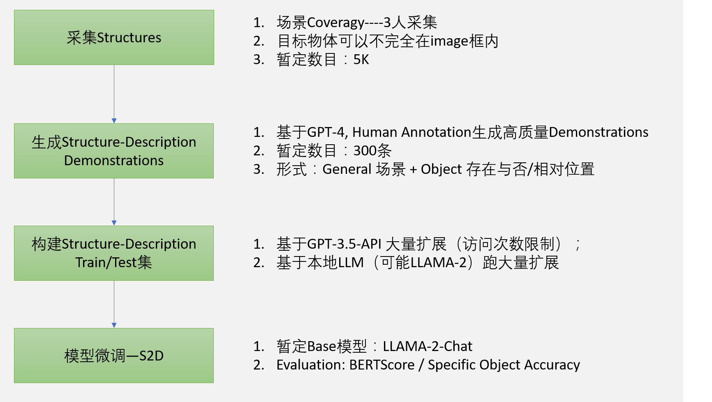

## Structure2Guidance Plan
### 1. Task-任务
整个NLP Pipeline部分的输入为来自Camera的结构化数据，输出为Text形式的Guidance。
整个任务命名为Structure2Guidance，由两个串联的模块共同完成：Structure2Description以及Description2Guidance.任务的基本结构如下图所示：

### 2. Framework-框架
从硬件资源、数据资源，模型以及算法，应用场景的分层角度出发，整个Pipeline的Framework如下图所示：

现有资源包括Hardware, LLM(开源或API)，需在此基础上搭建数据、算法以及应用模块。

需要注意的是，由于LLM具备多任务的能力，同时为了在硬件资源受限的情况下启动系统，S2D，D2G两个模块最后是***在一个模型上***实现，通过不同的instruction prompt获得结果，暂定Base模型为***LLaMA-2-Chat***.
### 3. Strcuture2Description (S2D)
S2D部分数据构建相对要求低，主要挑战在于***采集足够数量的Structures***。
当获取足量Structures之后，基于GPT或本地LLM大量扩展获取Descriptions。
最后对LLAMA-2-Chat进行模型微调。

### 4. Description2Guidance (D2G)
该部分数据构建相对困难，主要挑战在于***Guidance需要保证质量***。当前Description可能没有深度信息，在构建Guidance时，可能先用人工撰写的触觉表述构建demonstrations，再基于GPT-3.5/4大量生成（耗时长），最后可能还需要过滤。

### 5. Schedule-排期
初步的时间线如下所示：

具体的时间分配暂定如下---V1-有修改（见Structure2Description.md文件）：

| Week | Date      | Person | ToDo |
|------|-----------|--------|------|
| 1    | 0128-0202 | Yi     | 1. 收集Structures-1k条 2.基于GPT-4, Human Annotation生成高质量 S2D Demonstrations-100条 3. 搭建本地LLaMA-2-Chat模型，微调S2D模块|
|      |           | Jason  | 1. 收集Structures-2k条 2.基于GPT-4, Human Annotation生成高质量 S2D Demonstrations-100条 3. 搭建本地LLaMA-2模型或基于GPT-3.5-API访问，数据增广至3k条 |
|      |           | Zhenyu | 1. 收集Structures-2k条 2.基于GPT-4, Human Annotation生成高质量 S2D Demonstrations-100条 3. 基于GPT-3.5-API访问，数据增广至2k条|
| 2    | 0205-0209 | Yi     | 1.基于GPT-4, Human Annotation生成高质量 D2G Demonstrations-100条  2. 基于GPT-3.5-API访问，数据增广至2k条|
|      |           | Jason  | 1.基于GPT-4, Human Annotation生成高质量 D2G Demonstrations-100条 2. 基于GPT-3.5-API访问，数据增广至2k条 3.搭建本地LLaMA-2-Chat模型|
|      |           | Zhenyu | 1.基于GPT-4, Human Annotation生成高质量 D2G Demonstrations-100条 2. 基于GPT-3.5-API访问，数据增广至2k条|
| 3    | 0219-0223 | Yi     | 1. D2G 样本大规模扩充|
|      |           | Jason  | 1. D2G 样本大规模扩充|
|      |           | Zhenyu | 1. D2G样本大规模扩充|
| 4    | 0226-0301 | Yi     | 1. D2G 样本大规模扩充|
|      |           | Jason  | 1. D2G 样本大规模扩充|
|      |           | Zhenyu | 1. D2G样本大规模扩充|
| 5    | 0304-0308 | Y/J/Z  | To be filled|
| 6    | 0311-0315 | Y/J/Z  | To be filled|
| 7    | 0318-0322 | Y/J/Z  | To be filled|
| 8    | 0325-0329 | Y/J/Z  | To be filled|
| 9    | 0401-0405 | Y/J/Z  | To be filled|
| 10   | 0408-0412 | Y/J/Z  | To be filled|

