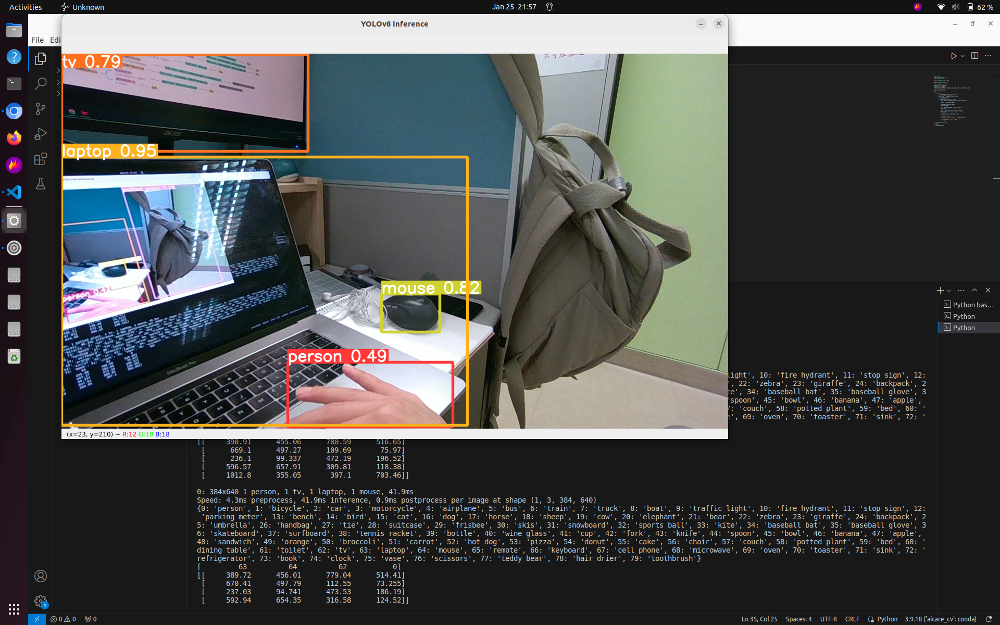
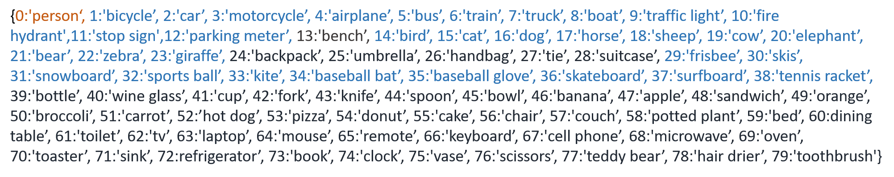
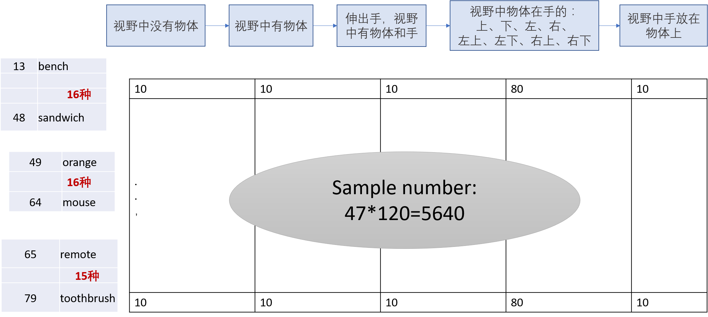

### Structure2Description （01.26）

#### 1. 现状 
1.1 样例

1.2 'hand'识别正在开发中(Rong Xiang)。
#### 2. 开发ToDo:
2.1 脚本修改，实现以下功能：快照，保存image-structure pairs到文件。
#### 3. 数据集构建的操作步骤： 
3.1 挑选这80个类别中的物品----暂定47种。 

3.2 存在的情况按照顺序：
   * “视野中没有物体”
   * “视野中找到了物体 
   * “伸出手，视野中有物体和手” 
   * “视野中物体在手的：上、下、左、右、左上、左下、右上、右下”
   * “视野中手放在物体上”
3.3 一共需要抓取的image-structure数目：47*（10+10+10+80+10）=5640

#### 4.工作计划 0128~0202：
* Yi: 1. 调整脚本便于样本收集；2.收集13-48中可用的类别的5种情况的样本（一部分）
* Jason：1. 搭建LlaMA-2模型环境，设计description prompt，并打通fine-tuning；2.收集49-64序号的5种情况样本（一部分）